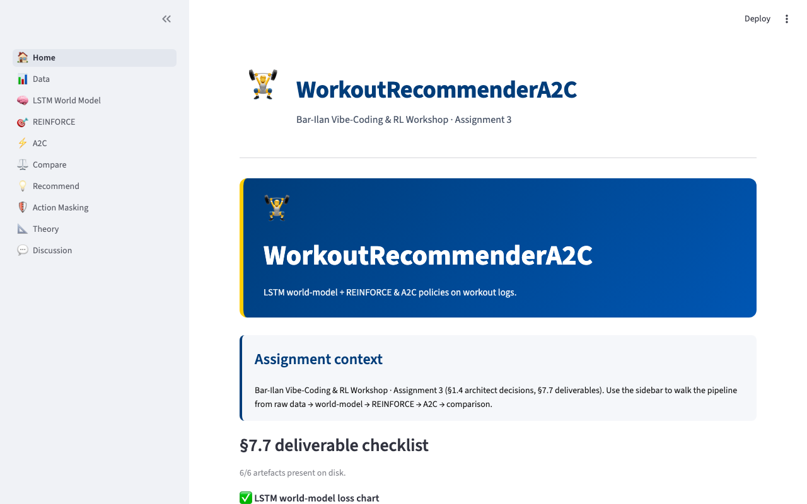
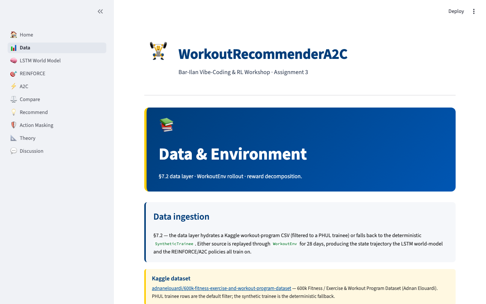
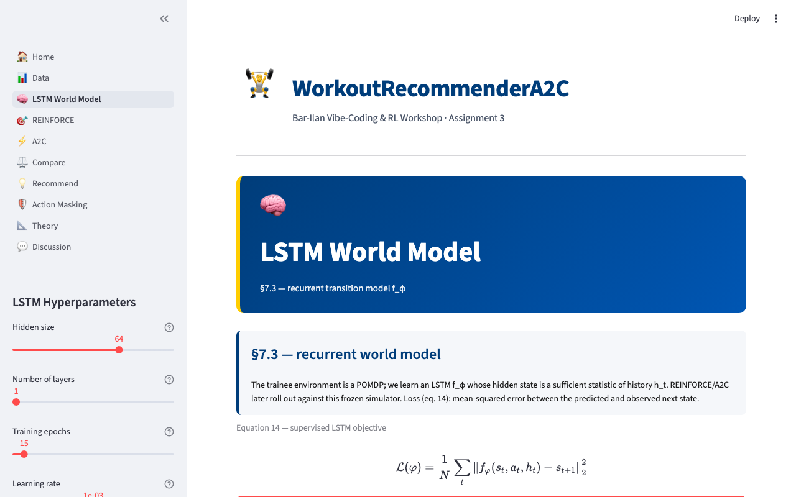
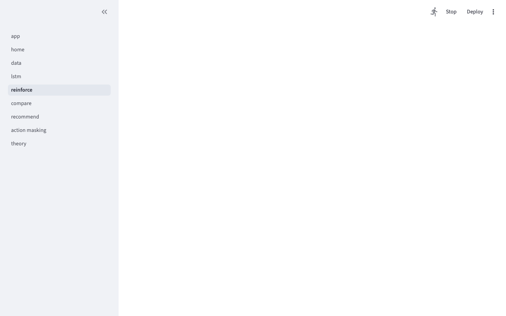
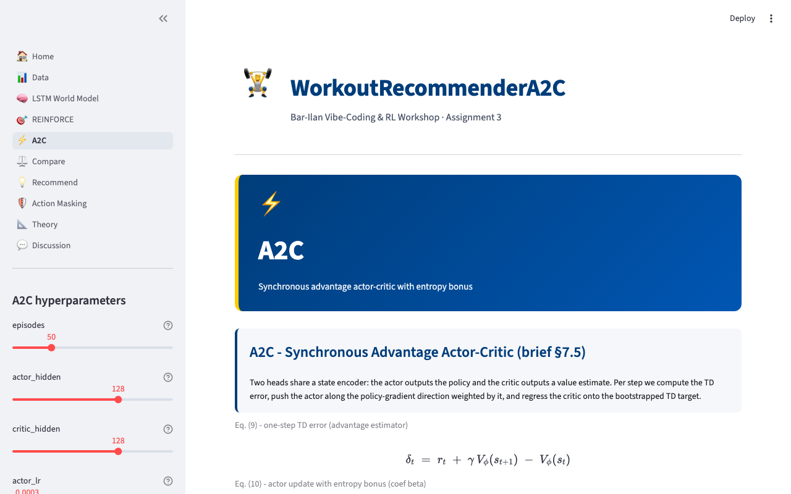
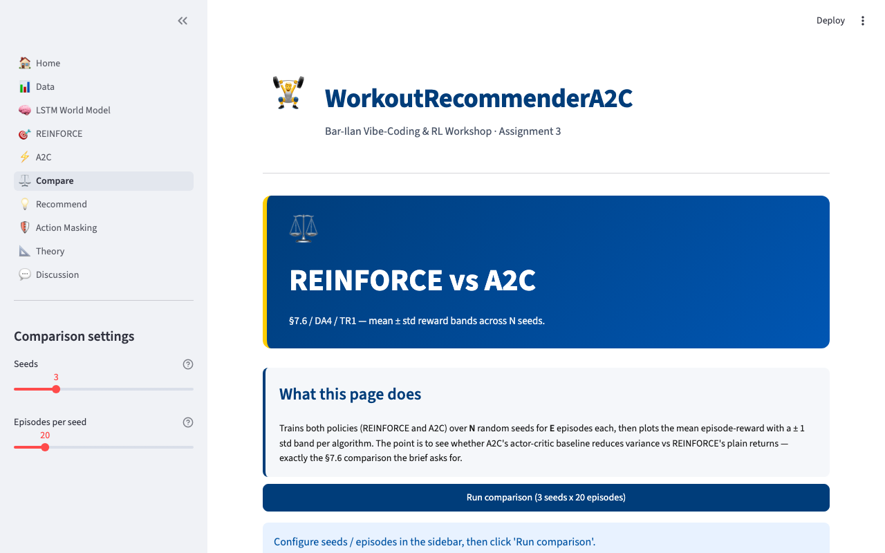
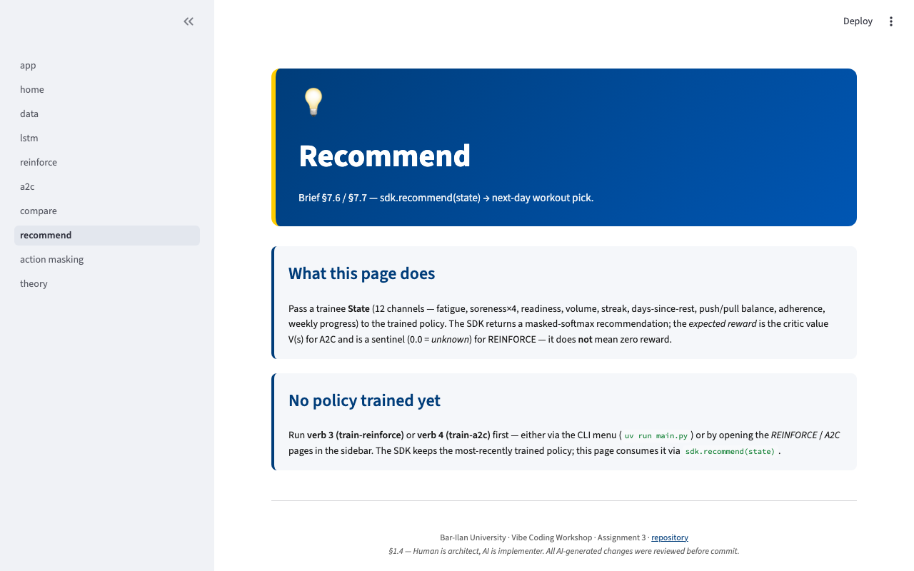
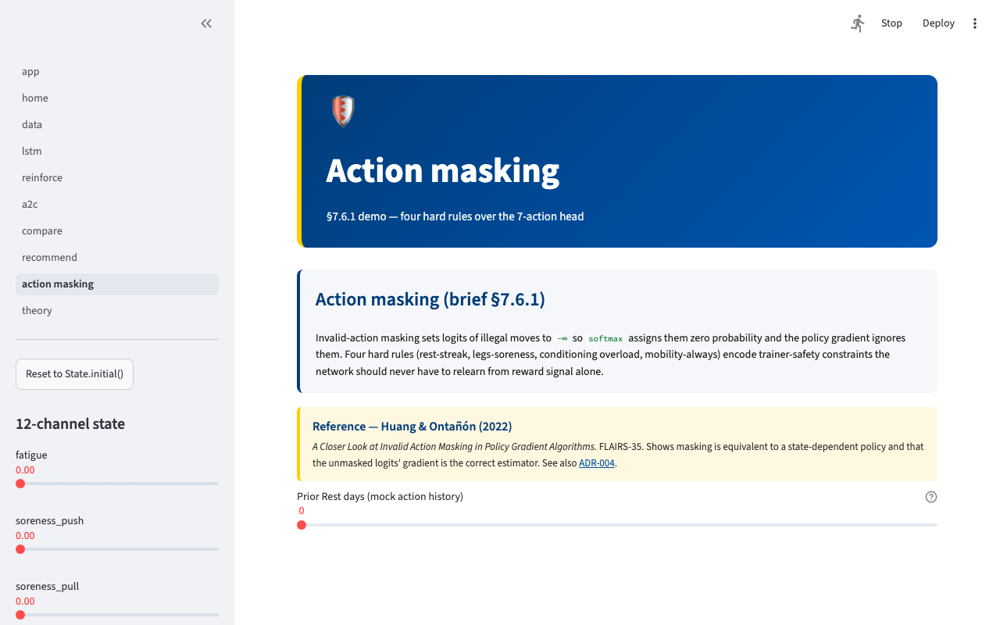
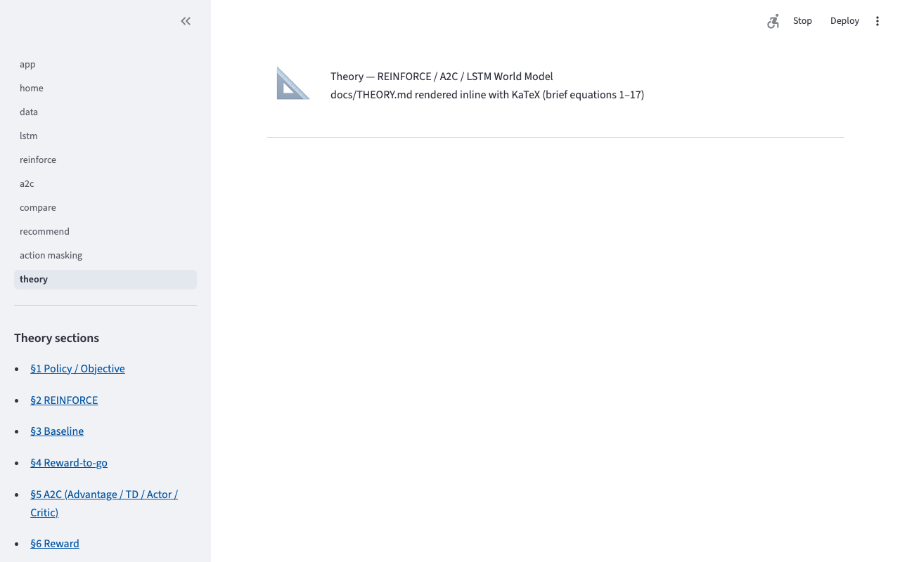
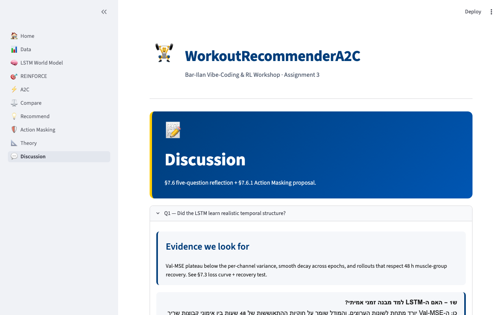

# WorkoutRecommenderA2C — Bar-Ilan Vibe-Coding & RL Workshop A3

An attempt to reproduce the §7 pipeline of Assignment 3 — an LSTM transition
model standing in for the unknown environment dynamics, with REINFORCE
(Williams 1992) and synchronous A2C (Mnih et al. 2016) trained by rolling out
against the **frozen LSTM world model**. That world model is fitted on the
day-level trajectory of a real chosen Kaggle program (**Optimized PHUL**, 12
weeks), loaded end-to-end from the committed dataset; the trainee simulator
supplies only the physiological response the dataset cannot. The repository is the human-architect / AI-implementer contract
described in `CLAUDE.md §1.4`: the human owns the spec, the rubric, and the
sign-off; the AI writes the code against the approved spec.

---

## Brief §-id → artifact map

Each binding §-id in the Assignment-3 brief maps to one as-built `src/`
file, one `tests/` file, and (where the brief asks for a graph) one
`results/figures/` chart. Every cell below resolves with `test -f`.
The full requirement → code → test traceability is in
[docs/TRACE.md](docs/TRACE.md).

| Brief § | Code | Test | Chart |
|---|---|---|---|
| §7.1 State (12-d vector) | `src/env/state.py` | `tests/unit/env/test_state.py` | — |
| §7.2 Dataset (PHUL filter) | `src/data/program_filter.py` | `tests/unit/data/test_program_filter.py` | — |
| §7.2.4 Trajectory (eq. 13) | `src/data/program_loader.py`, `src/model/program_trajectory.py` | `tests/unit/model/test_program_trajectory.py` | `results/data_quality_report.txt` |
| §7.3 LSTM world model | `src/model/lstm_world.py` | `tests/unit/model/test_lstm_world.py` | `results/figures/lstm_loss.png` |
| §7.4 REINFORCE | `src/services/reinforce_trainer.py` | `tests/unit/services/test_reinforce_trainer.py` | `results/figures/reinforce_rewards.png` |
| §7.5 A2C | `src/services/a2c_trainer.py` | `tests/unit/services/test_a2c_trainer.py` | `results/figures/a2c_training.png` |
| §7.6 Compare (REINFORCE vs A2C) | `src/services/comparator.py` | `tests/unit/services/test_comparator.py` | `results/figures/comparison.png` |
| §7.7 Plots & sensitivity scripts | `scripts/run_seeded_comparison.py`, `scripts/run_lr_sweep.py`, `scripts/run_lambda_sensitivity.py`, `scripts/run_lstm_convergence.py` | — | `results/figures/*.png` |

---

## Installation & Quick Start

```bash
uv sync --dev
uv run main.py                                # interactive CLI menu
uv run jupyter lab notebooks/analysis.ipynb   # §7.7 chart deliverables + LaTeX
uv run pytest tests/                          # 432 tests, ~91% coverage
```

For a one-shot non-interactive smoke check:

```bash
uv run pytest tests/ --cov=src --cov-report=term-missing
uv run ruff check src/ tests/ main.py
```

The CLI menu exposes the Phase-2 → Phase-5 pipeline (data ingest, LSTM training,
REINFORCE training, A2C training, comparison runs). All artefacts land under
`results/` (checkpoints, figures, run-logs); the notebook reads from there
without re-running training.

---

## Usage

Three entry points cover every supported workflow:

1. **Interactive CLI menu** — `uv run main.py` opens the verb picker (data, LSTM,
   REINFORCE, A2C, compare, recommend, GUI).
2. **Streamlit GUI** — `uv run main.py` then choose option 7, or jump straight in
   with `uv run streamlit run src/gui/app.py` (ADR-006).
3. **Jupyter notebook** — `uv run jupyter notebook notebooks/analysis.ipynb` for
   the §7.7 chart deliverables and the LaTeX-rendered discussion cells.

---

## Examples

The primary worked example is
[notebooks/analysis.ipynb](notebooks/analysis.ipynb) — it runs the full
prepare-data → train-LSTM → train-REINFORCE → train-A2C → compare pipeline with
fixed seed 42 and re-creates every figure cited in the report. A pre-executed
copy is committed at
[notebooks/analysis_executed.ipynb](notebooks/analysis_executed.ipynb).

Three quick-start CLI invocations for graders who prefer the terminal:

```bash
uv run main.py                                # interactive verb menu (recommended)
uv run python -c "from src.sdk import prepare_data; prepare_data()"   # data only
uv run streamlit run src/gui/app.py           # full GUI (Phase 9)
```

---

## Documents

Every artefact below is referenced from `docs/TRACE.md` (R6 traceability) so
that each PRD requirement, ADR decision, and brief-equation has at least one
linkable home.

**Primary specs**
- [PRD](docs/PRD.md) — product requirements and acceptance criteria
- [PLAN](docs/PLAN.md) — phased architecture (C4 mermaid diagram inside)
- [TODO](docs/TODO.md) — phase-by-phase task tracker
- [THEORY](docs/THEORY.md) — twelve load-bearing equations from the brief,
  transcribed verbatim with `src/` → test → paper mapping
- [TRACE](docs/TRACE.md) — requirement → code → test traceability matrix
- [PROMPTS](docs/shared/PROMPTS.md) — literal prompts used during AI-implementer
  generation (Vibe-Coding workshop deliverable)

**Design notes**
- [State design](docs/STATE_DESIGN.md) — 12-dim moderate state (C2_moderate_12d)
- [Action design](docs/ACTION_DESIGN.md) — 7-action discrete space
- [UX](docs/UX.md) — Nielsen's 10 heuristics + 5 quality criteria mapped
  to GUI pages and screenshots (V3 §10)

**Architecture Decision Records**
- [ADR-001 — hybrid architecture](docs/adr/ADR-001-hybrid-architecture.md)
- [ADR-002 — state representation](docs/adr/ADR-002-state-representation.md)
- [ADR-003 — reward weighting](docs/adr/ADR-003-reward-weighting.md)
- [ADR-004 — action masking](docs/adr/ADR-004-action-masking.md)
- [ADR-005 — terminal conditions](docs/adr/ADR-005-terminal-conditions.md)

**Quality**
- [QUALITY](docs/QUALITY.md) — ISO/IEC 25010:2011 product-quality
  characteristics mapped to concrete repo evidence (V3 §13).

**Notebook**
- [analysis.ipynb](notebooks/analysis.ipynb) — §7.7 chart deliverables + LaTeX
  cells. An executed copy with rendered outputs is committed at
  [analysis_executed.ipynb](notebooks/analysis_executed.ipynb) so graders can
  read the report without a Python kernel.

**Submission PDF**
- `adrl-001-ex03.pdf` — to be exported from
  `instructions/assignment-3/biu-rl07-ex01-template.docx` before submission.

---

## Dataset

This project uses the **600K+ Fitness Exercise & Workout Program Dataset**
(Adnane Louardi) from Kaggle:

- URL: https://www.kaggle.com/datasets/adnanelouardi/600k-fitness-exercise-and-workout-program-dataset
- License: ODbL 1.0 — non-commercial use only
- Source: Boostcamp.app
- Chosen program (real, §7.2.4): **Optimized PHUL (Power Hypertrophy Upper Lower)**
  — Full Gym, 12 weeks, 90 min/session, 4 days/week. Fallbacks in
  `config/config.yaml` (`dataset.fallback_programs`): "PHUL 12 Week Program!",
  "PHUL Full Body". The pipeline loads these real rows end-to-end
  (`src/data/program_loader.py` → `src/model/program_trajectory.py`).
- **Committed inputs** (so the pipeline is reproducible without Kaggle creds):
  the real `data/raw/program_summary.csv` (2,598 programs) and the §7.2.4
  PHUL subset `data/raw/programs_detailed_phul_subset.csv` (the chosen program's
  real exercise rows, extracted from the 294 MB `programs_detailed_boostcamp_kaggle.csv`).
  Refresh the full file any time via `kaggle datasets download -d <slug> --unzip`
  into `data/raw/` (it stays git-ignored).
- See PRD §1.5.0 for the data-quality contract: negative rep counts are
  reclassified as seconds (time-encoded exercises like planks); rest days are
  inserted on cycle gaps; license acknowledgement is asserted in tests.

---

## Architecture

The codebase is laid out by phase rather than by layer, because each phase
maps to a brief section and to a self-contained test suite.

```
src/
├── data/        # Phase 1 — Kaggle client, preprocessor, aggregator
├── env/         # Phase 2 — SyntheticTrainee state evolution + reward + masks
├── model/       # Phase 3 — LSTM world model, trainer, windowed dataset
├── sdk/         # Phase 4 — REINFORCE / A2C agents (one entry point)
├── services/    # Phase 5 — comparator, run orchestration
├── cli/         # interactive menu (no business logic)
└── utils/       # config loader, seeding, logging
```

The full C4-style mermaid diagram lives in [PLAN.md](docs/PLAN.md) §3
(Component view). Two boundary contracts are worth calling out here:

1. **`src/sdk/`** is the single business-logic entry point. The CLI imports
   from `sdk/`; `sdk/` imports from `model/`, `env/`, `data/`. No reverse
   edges. This is what `CLAUDE.md §3` (OOP) and CLAUDE.md `§4` (no hardcoded
   values) buy us — config flows from `config/config.yaml` through `sdk/`
   into every layer.
2. **`env/` ↔ `model/` swap point.** The Phase-2 `SyntheticTrainee` and the
   Phase-3 frozen LSTM expose the same `next_state(state, action) -> state`
   signature. REINFORCE and A2C are rolled out against either, controlled
   by a single config flag. This is the design that makes the brief §7's
   "learned simulator" claim falsifiable in code.

---

## Visual tour

The Streamlit GUI (Phase 9, ADR-006) covers all 6 SDK verbs plus Theory & Discussion. Launch with `uv run main.py` → verb 7 OR directly: `uv run streamlit run src/gui/app.py`.

### Pages

| Icon | Page | What it shows |
|---|---|---|
| 🏠 | Home | Brief §7.7 deliverable checklist + CI badge + quick-start |
| 📊 | Data | sdk.prepare_data() + 28-day muscle-distribution heatmap |
| 🧠 | LSTM World Model | LSTMTrainer with live per-epoch loss curve + hyperparameter sliders |
| 🎯 | REINFORCE | sdk.train_reinforce with live reward curve |
| ⚡ | A2C | sdk.train_a2c with live 3-panel actor/critic/reward chart |
| ⚖️ | Compare | sdk.compare REINFORCE-vs-A2C mean±std band |
| 💡 | Recommend | sdk.recommend with 12 state sliders + probability bar + reward decomposition |
| 🛡️ | Action Masking | Brief §7.6.1 demo: unmasked vs masked softmax side-by-side + Huang & Ontañón 2022 |
| 📐 | Theory | docs/THEORY.md rendered with KaTeX equations + src/ cross-links |
| 💬 | Discussion | Brief §7.6 Q1-Q5 + §7.6.1 writeup; embeds session-state comparison chart |

### Screenshots





















---

## Algorithms

### LSTM World Model (THEORY §7.3, eq. 14)

`src/model/lstm_world.py::LSTMWorldModel` learns the partially-observable
transition $\hat{s}_{t+1} = f_\phi(s_t, a_t, h_t)$ where $h_t$ is the LSTM
hidden state carrying history. Architecturally: 12-dim state concatenated
with an 8-dim learned action embedding (Ha & Schmidhuber 2018), passed
through `nn.LSTM(hidden=64, num_layers=1)`, projected to a 12-dim next-state
prediction. Trained with MSE on sliding-window trajectories from the Phase-2
SyntheticTrainee under a baseline policy. The trained $f_\phi$ is frozen
(`requires_grad=False`) and serves as the transition kernel for Phases 4-5.

### REINFORCE (THEORY §2.4, eq. 2 / §7.4, eq. 16)

The Williams 1992 update — one network, sample-based, model-free with respect
to the *true* dynamics (we use the LSTM as a learned simulator):

$$\theta \leftarrow \theta + \alpha \sum_t \nabla_\theta \log \pi_\theta(a_t \mid s_t) \, G_t$$

Implemented as weighted cross-entropy (THEORY §X — the brief's §2.6
equivalence) so the loss is one PyTorch line:
`loss = (F.cross_entropy(logits, action, reduction='none') * G_t.detach()).sum()`.
Baseline subtraction (eq. 4) uses a running mean (`baseline_alpha = 0.05`)
to reduce variance without learning a second network.

### A2C (THEORY §5.5, eq. 10-12 / §7.5, eq. 17)

Synchronous A2C — actor head, separate critic head, both single-layer FC
(width 128). The actor uses the TD-error as the advantage estimate:

$$A_t = r_t + \gamma V_\psi(s_{t+1}) - V_\psi(s_t)$$

The actor loss is the same weighted-cross-entropy as REINFORCE with $G_t$
swapped for $A_t.\text{detach()}$ — that detach is the single most
common A2C bug, asserted in `tests/test_a2c_trainer.py`. The critic loss
is $\tfrac{1}{2}\,\delta_t^2$ (eq. 12). Actor and critic share no parameters
and have separate optimisers (`actor_lr = 3e-4`, `critic_lr = 1e-3` — critic
learns faster, standard A2C heuristic). Gradient clipping at $\|g\|_2 \le 0.5$.

---

## Configuration

All algorithm-relevant parameters live in `config/config.yaml` per
`CLAUDE.md §4`. The top-level blocks:

| Block | What it controls |
|---|---|
| `environment` | episode length (28 days), state dim (12), action count (7), warmup |
| `rewards` | $\lambda_1, \lambda_2$, within-gain weights, overload threshold + exponent, baseline windows (ADR-003) |
| `data_quality` | seconds-per-rep, time-encoded exercise keywords, negative-rep policy (PRD §1.5.0) |
| `lstm` | hidden size 64, 1 layer, lr 1e-3, 50 epochs, window 7, action-embed dim 8 |
| `reinforce` | hidden 128, lr 3e-4, $\gamma$=0.99, 500 episodes, baseline α=0.05 |
| `a2c` | actor/critic hidden 128, separate lrs, entropy coef 0.01, grad-clip 0.5 |
| `action_masking` | rest-streak cap, soreness gate, conditioning-overload gate (ADR-004) |
| `dataset` | Kaggle slug, primary program, fallback programs, filter knobs |
| `paths` | data/raw, data/processed, results, checkpoints, figures |
| `device` | default cpu (determinism > speed); CUDA / MPS opt-in flags |

UI-styling literals (matplotlib `alpha`, `dpi`, figure size) stay in the
notebook — they are visual design, not tunable parameters. The
"would-a-grader-want-to-change-this" test from CLAUDE.md §4 decides.

---

## Quality Gates

Current values (re-run any of these before submission):

| Gate | Command | Current |
|---|---|---|
| Lint | `uv run ruff check src/ tests/ main.py` | clean (zero violations) |
| Format | `uv run ruff format --check src/ tests/ main.py` | clean (CI-enforced) |
| File-size cap | grep over `src/` for `.py` files | every file ≤ 150 LOC (CLAUDE.md §1) |
| Tests | `uv run pytest tests/` | 432 passed |
| Coverage | `uv run pytest tests/ --cov=src --cov-report=term-missing` | ~91% (gate ≥85%) |
| TDD discipline | per CLAUDE.md §2 | RED → GREEN → REFACTOR commits visible in log |

Phase-level integration tests (`test_phase{1..5}_integration.py`) gate each
phase boundary so a regression in Phase 3 cannot silently break Phase 5.

---

## Honest Limitations

1. The Kaggle dataset is plan-content (what programs *prescribe*), not real
   workout outcomes — the LSTM cannot learn true physiological response.
2. Single synthetic trainee → no claim about population generalisation.
3. The LSTM fit on plan-derived sequences may memorise periodisation patterns
   rather than learn dynamics; the held-out validation split (`val_split_days: 7`)
   only catches the most obvious overfit.
4. The reward function (eq. 15) is hand-designed (ADR-003); alignment with
   real strength-training goals is not validated. Brief §7.6 Q4 makes this
   caveat explicit and we answer it head-on in `docs/THEORY.md` §7.4.
5. All numeric claims (convergence, comparison) in the notebook cite
   seed + episode-count + mean ± std — never bare adjectives.

---

## Reproducibility Caveats

- **CUDA non-determinism.** `scatter_add` and `index_add` are non-deterministic
  on CUDA. We default to CPU (`device.default: cpu` in config); CUDA opt-in is
  documented but not used for any number reported in the notebook.
- **MPS LSTM kernels** are not bit-deterministic on Apple Silicon, so
  `device.allow_mps: false` by default.
- **DataLoader shuffle order** depends on worker scheduling under multi-worker
  loading — we run single-worker for the reported curves.
- **Mixed precision** adds drift; we report fp32 numbers.

Re-running `uv run pytest tests/` with the default config and seed (`seed: 42`)
reproduces every test number; re-running the notebook reproduces every figure.

---

## §1.4 Architect / Implementer Contract

This repository follows the Human ↔ AI responsibility contract documented in
[`CLAUDE.md §1.4`](CLAUDE.md). In short: requirements, architecture, test
acceptance criteria, final code-review sign-off, the self-grade claim, and
the cost-budget envelope are **human-decided and non-delegable**. Code
generation, refactoring inside a public API, test scaffolding from a written
spec, docstring drafts, and lint auto-fixes are **AI-delegated**.

The literal AI prompts used to produce the code are committed in
[`docs/shared/PROMPTS.md`](docs/shared/PROMPTS.md) — that file plus the per-section commit
messages (which name the brief § they address) is the audit trail.

---

## References

The numbers cited throughout `docs/THEORY.md` map to:

1. R. S. Sutton and A. G. Barto, *Reinforcement Learning: An Introduction*,
   2nd ed., MIT Press, 2018.
2. L. P. Kaelbling, M. L. Littman, A. R. Cassandra, "Planning and acting in
   partially observable stochastic domains," *Artificial Intelligence*, 1998.
3. R. J. Williams, "Simple statistical gradient-following algorithms for
   connectionist reinforcement learning," *Machine Learning*, 1992.
4. R. S. Sutton, D. McAllester, S. Singh, Y. Mansour, "Policy gradient
   methods for reinforcement learning with function approximation," NeurIPS 1999.
5. J. Schulman, P. Moritz, S. Levine, M. Jordan, P. Abbeel, "High-dimensional
   continuous control using generalized advantage estimation," ICLR 2016.
6. V. Mnih et al., "Asynchronous methods for deep reinforcement learning,"
   ICML 2016 (A3C; synchronous A2C is the natural simplification).
7. D. Ha and J. Schmidhuber, "Recurrent world models facilitate policy
   evolution," NeurIPS 2018.
8. S. Huang and S. Ontañón, "A closer look at invalid action masking in
   policy gradient algorithms," FLAIRS 2022.

---

## Contributing

Solo academic submission — no external contributors expected. For graders or
derivative academic work:

1. Clone the repo and run `uv sync --dev` to install dev dependencies.
2. Before any commit, run `uv run pre-commit run --all-files` (or, equivalently,
   `uv run ruff check src/ tests/ main.py && uv run pytest tests/`).
3. Commit subjects must match the allowed-prefix regex enforced in
   `tests/test_commits_reference_sections.py` (e.g. `Phase N fix —`, `PII scrub —`,
   `Phase N completion`, `Phase N gate-fix`).
4. Every commit carries a `Co-Authored-By: Claude …` trailer (Opus 4.7 for the
   build phases, Opus 4.8 for Phases 11+) per the §1.4 Architect / Implementer
   contract above.

---

## License

MIT — see [LICENSE](LICENSE).

The Kaggle dataset itself is ODbL 1.0 (non-commercial), separately attributed
to Adnane Louardi / Boostcamp.app. The dataset is *referenced* by this
repository, not redistributed.

---

## Course Context

- **University:** Bar-Ilan University
- **Course:** Vibe-Coding Workshop + Reinforcement Learning (combined L07 track)
- **Instructor:** Dr. Yoram Segal
- **Group code:** `adrl-001`
- **Assignment:** 3 — LSTM world model + REINFORCE + A2C on a single
  synthetic workout trainee, with the Kaggle PHUL program as the
  bootstrap data source.

The numeric self-grade claim against the rubric lives on the Moodle cover
sheet only — not in this README, on principle (over-confidence lesson
inherited from Assignment 1's post-mortem in
`instructions/assignment-3/lecturer_feedback.md`).

---

## Submission & repository

- **Repository**: https://github.com/adirelm/WorkoutRecommenderA2C (public)
- **Branch**: `main`
- **Latest tag**: `v1.1.1` (CI green)
- **CI**: see [.github/workflows/ci.yml](.github/workflows/ci.yml) — runs ruff lint+format, file-size guard, pytest with ≥85% coverage gate
- **Self-grade**: see Moodle cover sheet (not committed — contains PII)
- **Lecturer access**: `rmisegal` added as read-only collaborator
