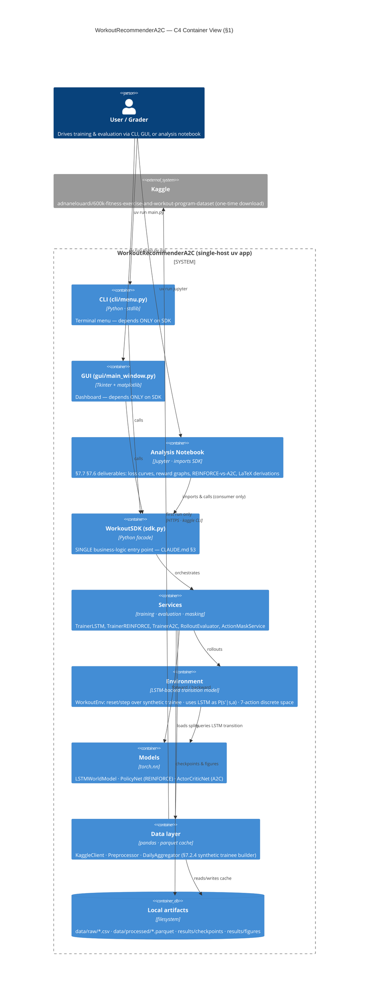

# PLAN — architecture & design (WorkoutRecommenderA2C)

Design/architecture doc (§2.2) for Assignment 3 — *LSTM world-model +
REINFORCE + A2C* applied to the 600K+ Fitness Exercise & Workout
Program Kaggle dataset. Single source-of-truth that aggregates
architecture, layering, ADRs, interface contracts, the concurrency
decision, and the **hybrid runtime-code + analysis-notebook**
delivery shape mandated by the lecturer's §7.7 hand-in list.

> **Scope note (honesty).** This plan describes an attempt to reproduce
> the §7 pipeline on a *single synthetic trainee* derived from one
> Kaggle program. It is not a population study. See PRD §11 and
> README §Honest Limitations for the four caveats (plan-content data
> ≠ real workout outcomes; single trainee = no generalisation;
> LSTM may memorise periodisation rather than learn dynamics;
> hand-designed reward may not align with real training goals).

## §1 — Architecture (C4-Container, mermaid)

**Context.** One user (or grader) drives WorkoutRecommenderA2C; the
only external system is Kaggle (one-time dataset download — keyed but
public). No DB, no broker, no inference server.

**Containers / layers** (Consumers → SDK → Services → Domain → Infrastructure):



**Dependency rule.** Arrows point downward only — a UI/notebook never
imports an engine module; the SDK is the seam (CLAUDE.md §3). The
notebook is a *consumer* of the SDK exactly like the CLI and GUI, so
runtime gates (ruff, ≤150 LOC, ≥85% coverage) apply uniformly to
`src/` while the notebook stays in `notebooks/`.

> See also: per-aspect Mermaid files in [diagrams/](diagrams/) — data-flow, OOP-layers, and the train-a2c sequence walkthrough.

**Action space.** Discrete, cardinality **7**:
`{ 0:Rest, 1:Push, 2:Pull, 3:Legs, 4:FullBody, 5:Conditioning, 6:Mobility }`.
The §7.6 action-masking guardrails act on this 7-vector (ADR-004).

## §2 — Build phases (10 phases × 1–3 PRDs each)

Sequenced as phase-milestones; each phase is a single TDD commit
(RED → GREEN → REFACTOR) on branch `assignment-3`. Each phase has a
PRD under `docs/` and a definition-of-done in `docs/TODO.md`.

| # | Phase | PRDs owned | Definition of Done | Lecture-spec link |
|---|---|---|---|---|
| 1 | **Data ingest & cache** | `PRD_data.md` | Kaggle CSVs cached to parquet; tests on schema, row counts, negative-value handling (§7.2.3 caveat); cleaning report emitted to `results/data_quality_report.txt` | §7.2.1–§7.2.3, PRD §1.5.0 |
| 2 | **Synthetic-trainee builder** | `PRD_preprocess.md`, `PRD_trajectory.md` | `chosen_program` filter (≥8wk, Full Gym, 45–120min); daily aggregation; `total_volume_t`, `muscle_distribution_t`, `session_duration_t`, `week_index_t`, `day_in_cycle_t`; Rest-Day rows inserted per §7.2.4 | §7.2.4 (eq. 13) |
| 3 | **LSTM world-model** | `PRD_lstm.md` | `LSTMWorldModel(s_t,a_t,h_t)→ŝ_{t+1}` trains on supervised windows; loss curves logged; checkpoint emitted | §7.3 (eq. 14) |
| 4 | **Environment wrapper** | `PRD_env.md`, `PRD_action_masking.md` | `WorkoutEnv.reset/step` returns `(s, r, done, info)` over LSTM transitions; rewards via §7.4.2 (eq. 15: `r = gain − λ₁·overload − λ₂·imbalance`); action-masking guardrails (§7.6.1, ADR-004) | §7.4.2, §7.6.1 |
| 5 | **REINFORCE agent** | `PRD_reinforce.md` | `PolicyNet` (7-class softmax) + episodic policy-gradient update (eq. 16); reward-to-go + baseline; per-episode return logged | §7.4 (eq. 16), §2–§3 |
| 6 | **A2C agent** | `PRD_a2c.md` | `ActorCriticNet` (shared trunk, two heads); TD-advantage `A_t = r_t + γV(s_{t+1}) − V(s_t)` (eq. 17); actor + critic loss; entropy bonus | §7.5 (eq. 17), §5 |
| 7 | **SDK facade** | `PRD_sdk.md` | `WorkoutSDK.prepare_data / train_lstm / train_reinforce / train_a2c / recommend / save_brain / load_brain`; CLI/GUI/notebook all depend on it | CLAUDE.md §3 |
| 8 | **CLI menu** | `PRD_cli.md` | `cli/menu.py` numeric menu wraps the SDK; no business logic in UI | §1.4 contract |
| 9 | **GUI dashboard** | `PRD_gui.md` | Tkinter+matplotlib: training curves live, recommend-button shows top-k action with masking explanation | A2 parity |
| 10 | **Analysis notebook + docs** | `PRD_notebook.md`, `PRD_results.md` | `notebooks/analysis.ipynb` renders §7.7 figures (LSTM loss, REINFORCE reward, A2C reward, REINFORCE-vs-A2C, §7.6 discussion) **with LaTeX derivations of eq. 2, 16, 17 next to plots**; README + ADRs + PROMPTS.md current | §7.6, §7.7 |

## §3 — Layer responsibilities

| Layer | Modules (under `src/workoutrl/`) | Responsibility | Forbidden |
|---|---|---|---|
| **data** | `data/kaggle_client.py`, `data/preprocessor.py`, `data/aggregator.py`, `data/cleaning.py` | One-time Kaggle download → parquet cache; build `chosen_program` synthetic-trainee trajectories; data-quality rules (negative-rep drop, time-encoded reps reclassification, rest-day insertion — PRD §1.5.0) | No torch, no RL logic |
| **env** | `env/workout_env.py`, `env/reward.py`, `env/action_mask.py` | Gym-like `reset/step`; reward `r = gain − λ₁·overload − λ₂·imbalance` (eq. 15); action-masking (§7.6.1, ADR-004) | No model training; no UI |
| **model** | `model/lstm_world.py`, `model/policy_net.py`, `model/actor_critic.py` | `nn.Module` definitions only; no training loop | No env access; no I/O |
| **services** | `services/trainer_lstm.py`, `services/trainer_reinforce.py`, `services/trainer_a2c.py`, `services/evaluator.py`, `services/metrics.py` | Training loops, rollout collection, advantage/return computation, checkpoint I/O | No direct user I/O |
| **sdk** | `sdk.py` | Single façade — orchestrates services; the **only** import surface for UIs and the notebook | No training math inline |
| **cli** | `cli/menu.py`, `cli/__main__.py` | Numeric terminal menu; arg-parse | Imports anything below SDK |
| **gui** | `gui/main_window.py`, `gui/charts.py`, `gui/controller.py` | Tkinter window + matplotlib panels | Imports anything below SDK |
| **utils** | `utils/seeding.py`, `utils/io.py` | Cross-cutting helpers (deterministic seeding — see §7; atomic checkpoint writes) | No business logic |
| **notebook** | `notebooks/analysis.ipynb` | §7.7 deliverables as a *consumer* of the SDK; LaTeX cells next to plots | Re-implementing engine logic |

Every `src/**/*.py` ≤ **150 code lines** (CLAUDE.md §1). DRY-shared
helpers live in `services/_shared.py` / `model/_blocks.py`.

## §4 — Public API contracts per layer

| Layer | Symbol | Signature |
|---|---|---|
| **sdk** | `WorkoutSDK` | `prepare_data() → {splits}` · `train_lstm(epochs) → LossHistory` · `train_reinforce(episodes) → RewardHistory` · `train_a2c(episodes) → RewardHistory` · `recommend(state) → {action, probs, value, masked}` · `save_brain(path)` · `load_brain(path)` |
| **data** | `KaggleClient` | `ensure_dataset(force_refresh=False) → Path` |
| **data** | `Preprocessor` | `build_trajectory(chosen_program_id) → list[State]` |
| **env** | `WorkoutEnv` | `reset(seed) → State` · `step(action) → (State, float, bool, dict)` · `action_space → int` (**7**) · `state_dim → int` |
| **env** | `ActionMaskService` | `mask(state) → BoolTensor[7]` (eq. §7.6.1 — unsafe actions → −∞ logits before softmax, see ADR-004) |
| **model** | `LSTMWorldModel` | `forward(s, a, h) → (ŝ_next, h_next)` |
| **model** | `PolicyNet` | `forward(s) → logits[7]` |
| **model** | `ActorCriticNet` | `forward(s) → (logits[7], value)` |
| **services** | `TrainerLSTM` | `fit(windows, epochs) → LossHistory` |
| **services** | `TrainerREINFORCE` | `train(env, policy, episodes, baseline) → RewardHistory` |
| **services** | `TrainerA2C` | `train(env, ac_net, episodes, γ, entropy_coef) → RewardHistory` |
| **services** | `RolloutEvaluator` | `evaluate(policy, env, n_episodes) → EvalReport` |
| **utils** | `set_global_seed` | `set_global_seed(seed: int) → None` — seeds `random`, `numpy`, `torch` (CPU+CUDA), `PYTHONHASHSEED`; toggles cuDNN deterministic flags |

All return types are explicit dataclasses in `src/workoutrl/types.py`
— never raw dicts crossing the SDK boundary.

## §5 — Test strategy

Three layers of tests under `tests/`, all driven by
`uv run pytest tests/ --cov=src --cov-report=term-missing`
gating at **≥85%** (CLAUDE.md §2).

| Tier | Scope | Examples |
|---|---|---|
| **Unit** | One module at a time, no torch training | `test_aggregator.py` (eq. 13 sums), `test_reward.py` (eq. 15 sign — `gain − λ₁·overload − λ₂·imbalance`), `test_action_mask.py` (masked logits → 0 probability after softmax), `test_policy_net_shapes.py` (logits shape `[7]`), `test_data_quality.py` (negative_reps_row_dropped, plank_reclassified, rest_day_inserted, total_volume_nonneg), `test_reproducibility.py` (two seeded LSTM forwards bit-identical) |
| **Integration** | SDK-level, short episodes, fixed seed | `test_sdk_train_reinforce_smoke.py` (3 episodes, deterministic seed → reward curve produced), `test_sdk_train_a2c_smoke.py`, `test_env_lstm_roundtrip.py` |
| **Lecture-spec compliance** | Pins formulas to source-of-truth | `test_spec_eq14_lstm_signature.py`, `test_spec_eq15_reward_formula.py`, `test_spec_eq16_reinforce_update.py`, `test_spec_eq17_advantage.py`, `test_spec_section_7_7_deliverables_exist.py` (asserts notebook produces the four required figures) |

Notebook execution is verified by `nbclient` in CI — `analysis.ipynb`
must run top-to-bottom on the cached data without error.

**Architecture justification (rubric framing, not numeric prediction).**
The hybrid runtime + notebook shape is chosen because it covers the
*Implementation Quality* rubric dimension (testable engine spine with
ruff / ≤150-LOC / ≥85 % coverage gates — which a notebook-only build
cannot satisfy) **and** the *Explanation / Analysis* dimension (LaTeX
derivations next to plots, §7.6 discussion answered head-on — which a
runtime-only build cannot satisfy without a parallel write-up). A
pure-notebook approach loses the engineering gates; a pure-runtime
approach loses the discussion surface the brief grades in §7.6/§7.7.

## §6 — Concurrency / state assumptions

**Single-threaded by design**, same as A2. Cost centres are CPU-bound
(LSTM + policy forward/backward) and trivial I/O (parquet read once
per session). For a single sequential RL loop at this scale
(≤a few thousand episodes), multiprocessing/threading adds complexity
with no real gain and the GIL is not the bottleneck.

State assumptions:
- `WorkoutEnv` holds **mutable hidden state** `h_t` for the LSTM; it
  is reset in `reset()` and is **not thread-safe**. Concurrent
  rollouts (a future improvement) must hold one env per worker.
- `TrainerREINFORCE` accumulates per-episode trajectories in memory
  (bounded by episode length × episodes-per-batch).
- `TrainerA2C` uses on-policy n-step rollouts; no replay buffer; the
  critic is updated synchronously after the actor.
- Checkpoints are written atomically (`*.pt.tmp` → rename) to
  survive Ctrl-C mid-train.

## §7 — Reproducibility

Determinism is a graded surface (lecturer's "variance" discussion in
§7.6). Seed the world end-to-end via **`src/workoutrl/utils/seeding.py`**
(exported helper `set_global_seed(seed: int) → None`):

```python
# src/workoutrl/utils/seeding.py
def set_global_seed(seed: int) -> None:
    random.seed(seed)
    np.random.seed(seed)
    torch.manual_seed(seed)
    torch.cuda.manual_seed_all(seed)
    os.environ["PYTHONHASHSEED"] = str(seed)
    torch.backends.cudnn.deterministic = True
    torch.backends.cudnn.benchmark = False
    torch.use_deterministic_algorithms(True, warn_only=True)
```

`tests/test_reproducibility.py` asserts that two seeded LSTM forwards
produce bit-identical tensors (assert via `torch.equal`).

Seeds live in `config/config.yaml` (one seed per phase: `seed_data`,
`seed_lstm`, `seed_reinforce`, `seed_a2c`) so a grader can reproduce
any single figure without re-running the others.

**Reproducibility caveats (documented in README §Reproducibility):**
- CPU is the default device; CUDA/MPS are opt-in via `config.device`.
- **CUDA non-determinism** in `scatter_add` / `index_add` cannot be
  fully eliminated even with `use_deterministic_algorithms(True)` —
  warn_only=True is set so the run does not crash on the few ops
  PyTorch flags.
- **Mixed-precision drift**: if AMP is enabled, fp16 rounding can
  diverge across runs; CPU runs use fp32 only.
- **Multi-worker DataLoader** shuffle order depends on worker-launch
  timing; we pin `num_workers=0` for the supervised LSTM phase.
- **MPS LSTM kernel determinism**: Apple's MPS backend does not yet
  guarantee bit-exact reproducibility for LSTM kernels — figures may
  drift by ≤1 % across runs; this is called out in the notebook
  discussion §7.6.
- Episode rewards are reported as **mean ± std over N seeds** (N≥3,
  declared per-figure), never as a bare single-run adjective.

## §8 — ADRs (pointers to `docs/adr/`)

ADRs live in `docs/adr/` and are linked from the README. Each ADR
follows the *Context → Decision → Consequences* shape used in A2.

| ADR | Title | Why it matters |
|---|---|---|
| **ADR-001** | Hybrid architecture: runtime SDK + ONE analysis notebook | The hybrid keeps the engineering spine (SDK facade, OOP, DRY, ≤150 LOC, ≥85 % coverage, ruff, uv) that CLAUDE.md §3 and the rubric reward, and adds a LaTeX-next-to-plots notebook for the §7.7 deliverables. A pure-notebook build fails the OOP/coverage/ruff/150-LOC gates; a pure-monolith collapses layer boundaries into a god-module. The hybrid wins on the *Implementation Quality* and *Explanation / Analysis* rubric dimensions simultaneously. |
| **ADR-002** | State representation = 7-day rolling window over (total_volume, muscle_distribution, session_duration, week_index, day_in_cycle) | Mirrors §7.3.1 step 1; a single day is not Markov, so we condition on a window; this exact tuple is what the LSTM is supervised to predict and what the policy consumes. |
| **ADR-003** | Reward weighting `r = gain − λ₁·overload − λ₂·imbalance` (eq. 15) with `λ₁=2.0`, `λ₂=1.0` in `config.yaml` | Lecturer's §7.4.2 gives the *shape* but leaves weights as a design choice. λ₁ > λ₂ keeps the policy safe (overload heavier) while leaving variety pressure (imbalance lighter) so the policy still explores muscle-group diversity. `imbalance_t = variance(muscle_share_14d)` is chosen over KL-divergence for differentiability. |
| **ADR-004** | Action Masking via `logits → −∞` pre-softmax (Huang & Ontañón 2022, FLAIRS — brief ref [8]) | Masking before softmax preserves policy-gradient unbiasedness (the masked action's probability is exactly 0, so `∇ log π(a)` is never computed on it), unlike post-hoc rejection which biases the gradient. Worked example: trainee did Legs yesterday with `soreness_legs > 0.8` → mask action 3 (Legs) the next day. Trade-off (safety vs exploration): guardrails act as "humans in the loop next to optimisation" — they shrink the search space deliberately. `ActionMaskService.mask(state) → BoolTensor[7]`; test asserts masked positions → probability 0 after softmax. |

## §9 — Milestones (today 2026-05-31 → deadline 2026-06-10)

Solo project, single-deadline. Phase-milestones are calendar-anchored
so the grader can audit pace; each is "reached" only when its PRD is
approved, its TDD commit lands, and all gates are green (ruff,
≤150 LOC, coverage ≥85 %, secret-scan, ADR updated if architecture
shifted).

| # | Date | Phase(s) | Deliverable |
|---|---|---|---|
| M1 | **2026-05-31** | P1 — Data ingest & cache | Kaggle CSVs → parquet; schema & data-quality tests green; cleaning report emitted |
| M2 | **2026-06-01** | P2 — Synthetic-trainee builder | `chosen_program` daily trajectory; eq. 13 unit test green; rest-day rows present |
| M3 | **2026-06-02** | P3 — LSTM world-model | `LSTMWorldModel` trained on supervised windows; loss curve checkpointed; reproducibility test green |
| M4 | **2026-06-03** | P4 — Environment + action mask | `WorkoutEnv.reset/step` green; reward eq. 15 + masking eq. §7.6.1 tested (ADR-004) |
| M5 | **2026-06-04** | P5 — REINFORCE agent | Policy-gradient update eq. 16; reward curve over multi-seed runs |
| M6 | **2026-06-05** | P6 — A2C agent | Advantage eq. 17; actor + critic losses; reward curve over multi-seed runs |
| M7 | **2026-06-06** | P7 — SDK facade | `WorkoutSDK` orchestrates all three trainers; integration smoke green |
| M8 | **2026-06-07** | P8 + P9 — CLI + GUI | Terminal menu + Tkinter dashboard wired through SDK |
| M9 | **2026-06-08** | P10a — Analysis notebook | `notebooks/analysis.ipynb` renders §7.7 four figures + LaTeX derivations of eq. 2/16/17; `nbclient` runs end-to-end |
| M10 | **2026-06-09** | P10b — Pre-submission review | 9-phase methodology walk; README + PROMPTS.md + ADRs refreshed; coverage ≥85 %, ruff zero |
| **DEADLINE** | **2026-06-10** | submission | tag `v1.0.0`, push, hand in |

## §10 — Deployment / install

Same single-host shape as A2 — no server, no container, no network
service after the first Kaggle fetch.

**Prerequisites**
- Python 3.11+ (managed by `uv`; do **not** install with pip/conda — CLAUDE.md §7)
- `uv` (`brew install uv` on macOS, `pipx install uv` elsewhere)
- Kaggle account + `~/.kaggle/kaggle.json` API token (one-time, for
  the initial CSV download; thereafter the parquet cache is committed
  and the app runs fully offline)
- ≈300 MB free disk for the dataset cache + checkpoints
- (Optional) Apple-Silicon Mac for MPS acceleration, or CUDA GPU

**Install**
```bash
uv sync --dev                              # creates .venv, installs deps + dev tools
uv run kaggle datasets download \
   -d adnanelouardi/600k-fitness-exercise-and-workout-program-dataset \
   -p data/raw/ --unzip                     # one-time; skip if data/raw/*.csv present
uv run pytest tests/ --cov=src              # gate: ≥85 % coverage, must be green
uv run ruff check src/ tests/ main.py       # gate: zero violations
```

**Run**
```bash
uv run main.py            # terminal menu (CLI)
uv run main.py gui        # Tkinter+matplotlib dashboard
uv run jupyter lab notebooks/analysis.ipynb   # §7.7 figures + LaTeX
```

**Mac-specific notes**
- Tkinter ships with python.org's CPython but **not** with all
  Homebrew Python builds — if `import tkinter` fails, install
  `python-tk` via Homebrew or use the python.org installer; the CLI
  and notebook paths do **not** require Tk.
- MPS backend: set `device: mps` in `config.yaml` to use it.
  Deterministic LSTM kernels are not yet guaranteed on MPS (see §7) —
  for the figures that ship with the submission, CPU is used.
- Kaggle CLI on macOS occasionally fails on first run with a
  permissions error on `~/.kaggle/kaggle.json` — fix with
  `chmod 600 ~/.kaggle/kaggle.json`.
